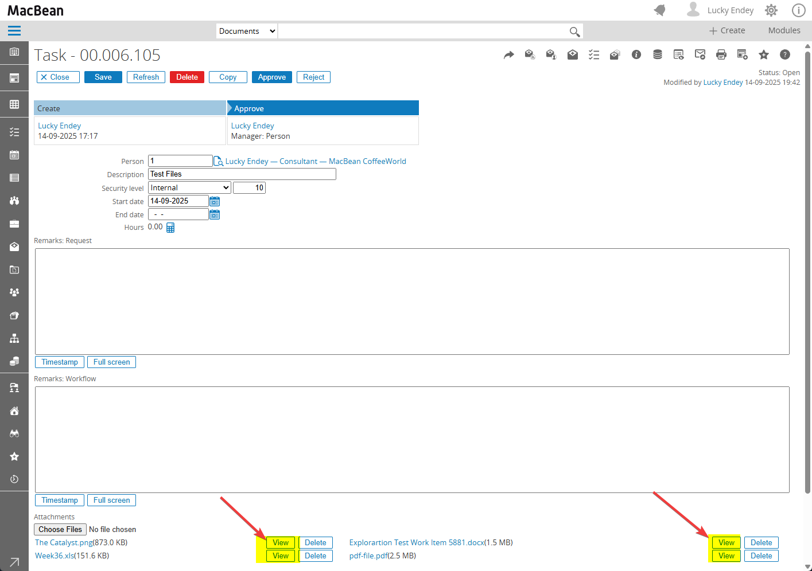

# CSSynergyX File Glance

A **page extension add-in** for Exact Synergy Enterprise that adds inline file viewing capabilities to attachment tables. This extension enhances the user experience by allowing users to preview documents directly within the Synergy interface without downloading them.

## Features

- **In-place File Preview**: View files directly in a modal overlay without leaving the current page
- **Multi-format Support**: Supports various file formats including:
  - **Images**: PNG, JPG, JPEG, GIF, BMP, WebP, SVG
  - **Documents**: DOCX (Word documents)
  - **Spreadsheets**: XLSX, XLS (Excel files)
  - **PDFs**: PDF documents
- **Interactive Image Viewer**: 
  - Zoom in/out functionality
  - Pan and drag to navigate large images
  - Fit to window and actual size options
  - Keyboard shortcuts for navigation
- **Responsive Design**: Modal viewer adapts to different screen sizes
- **Fallback Support**: Uses CDN resources with local fallbacks for reliability

## Installation

### Prerequisites
- Exact Synergy Enterprise 503 or later
- .NET Framework 4.7 or later
- Administrator access to the Synergy server

### Installation Steps

1. **Download the Extension:**
   - Download the latest release from the [releases page](https://github.com/luckyendey/CSSynergyX.FileGlance/releases)
   - Extract the downloaded ZIP file to a temporary folder

2. **Deploy Files:**
   - Copy all extracted folders (`bin`, `docs`, `xml`) to your Exact Synergy Enterprise installation directory:
     `C:\Exact Synergy Enterprise 503\`
   - The folders will automatically merge with existing directories

3. **Verify Installation:**
   - Open one of the workflow request with attachments
   - You should see **"View"** buttons next to the existing "Delete" buttons for each attachment
   
   - Click a "View" button to test the file preview functionality

## Usage

Once installed, the extension automatically:

1. **Detects attachment tables** on WflRequest pages
2. **Adds "View" buttons** next to existing "Delete" buttons for each attachment
3. **Enables file preview** when users click the "View" button

### Keyboard Shortcuts (Image Viewer)
- `Escape`: Close the modal
- `+` or `=`: Zoom in
- `-` or `_`: Zoom out  
- `0`: Reset to actual size
- `F`: Fit to window

## Browser Compatibility

- **Modern Browsers**: Chrome 60+, Firefox 55+, Safari 12+, Edge 79+
- **Features Used**: ES5 JavaScript, CSS3, HTML5 Canvas
- **Fallbacks**: Graceful degradation for unsupported browsers

## Development

### Building from Source

1. Clone the repository
2. Open `CSSynergyX.FileGlance.slnx` in Visual Studio
3. Build the project in Release mode
4. Copy all folders under the "setup" directory to your Synergy web server

## Credits

This project uses the following open-source libraries:

- **[SheetJS](https://github.com/SheetJS/sheetjs)** - Community Edition for parsing and writing spreadsheet files
- **[docxjs](https://github.com/VolodymyrBaydalka/docxjs/)** - JavaScript library for rendering DOCX documents in the browser
- **[JSZip](https://github.com/Stuk/jszip)** - JavaScript library for creating, reading and editing ZIP files

We extend our gratitude to the maintainers and contributors of these excellent libraries that make this project possible.

## License

This project is licensed under the GNU General Public License v3.0 - see the [LICENSE.txt](LICENSE.txt) file for details.

## Support

This is an open-source project. For issues, feature requests, or contributions, please refer to the project repository.

## Version History

- **v1.0.0** (2025): Initial release
  - Basic file preview functionality
  - Support for images, DOCX, XLSX, and PDF files
  - Interactive image viewer with zoom and pan
  - Integration with Exact Synergy Enterprise

---

**Note**: This extension is designed specifically for Exact Synergy Enterprise and requires the appropriate Synergy environment to function properly.
